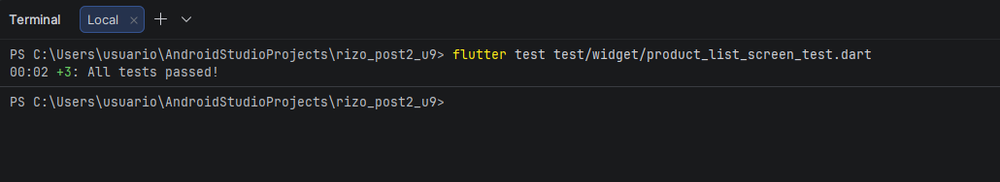
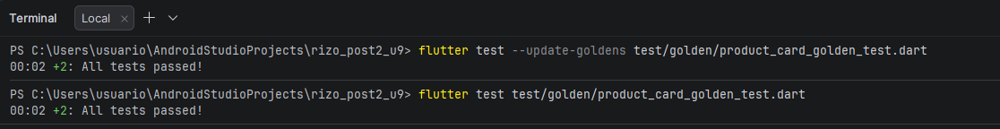
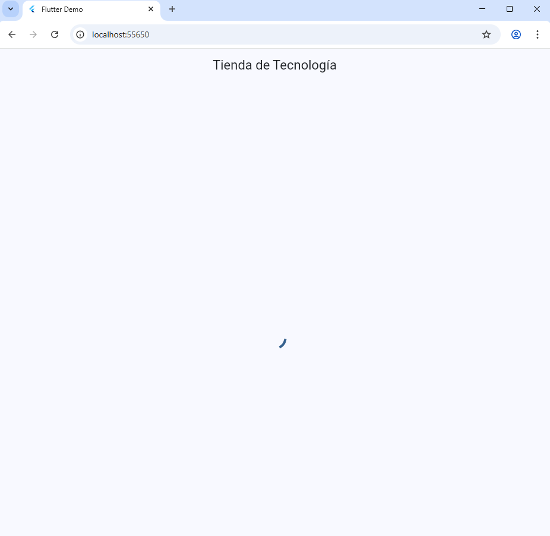
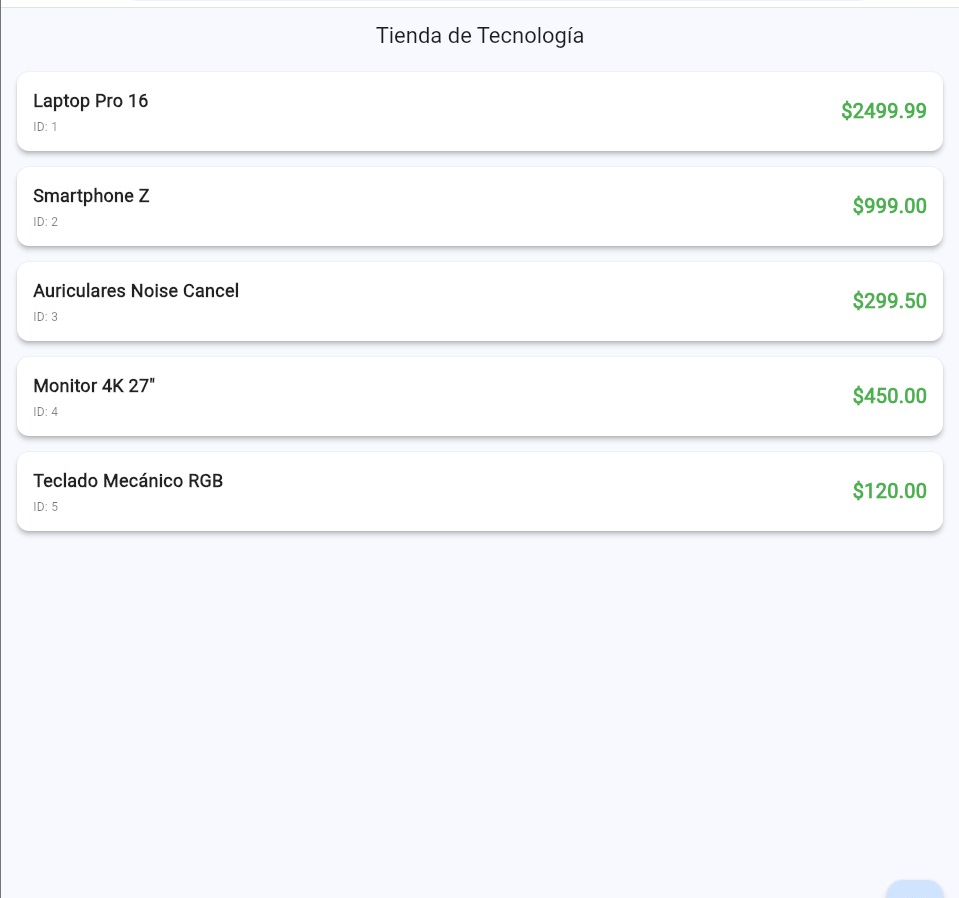
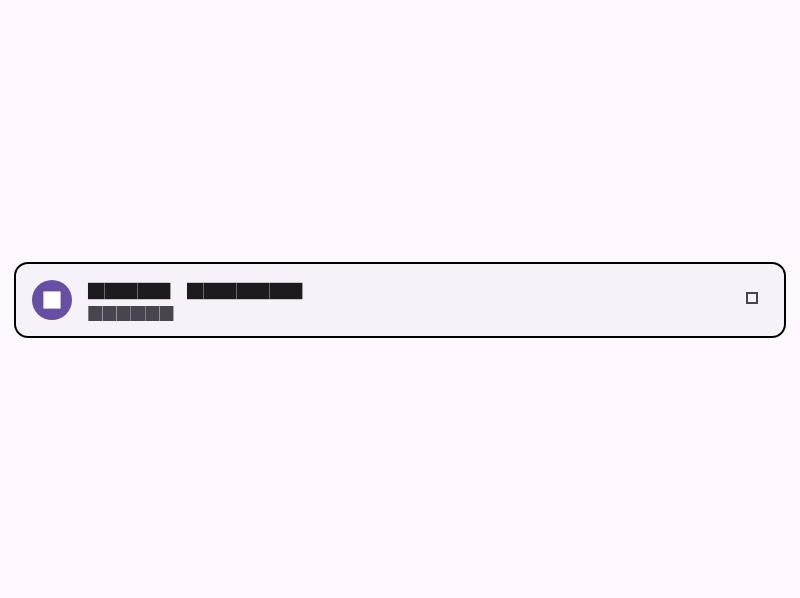

# Testing y Aseguramiento de Calidad en Aplicaciones Móviles - Flutter + BLoC + Widget Tests + Golden Tests

## Autor

- **Nombre:** Jhoseth Esneider Rozo Carrillo
- **Codigo:** 02230131027
- **Programa:** Ingenieria de Sistemas
- **Unidad:** 9 Testing y Aseguramiento de Calidad en Móvil
- **Actividad:** Post-Contenido 2
- **Fecha:** 07/05/2026

---

## Descripcion del Proyecto

Este proyecto implementa pruebas automatizadas para una aplicación Flutter utilizando arquitectura BLoC. El objetivo principal es validar el comportamiento visual y funcional de la pantalla `ProductListScreen` mediante widget tests y golden tests.

Durante el desarrollo se probaron los estados principales del BLoC (`Loading`, `Success` y `Error`), además de verificar interacciones del usuario como el botón de recarga. También se implementaron golden tests para detectar cambios visuales inesperados en los componentes de la interfaz.

El proyecto sigue una estructura organizada separando lógica de negocio, widgets y pruebas automatizadas.

### Funcionalidades Implementadas

- Widget tests para estado `Loading`
- Widget tests para estado `Success`
- Widget tests para estado `Error`
- Test de interacción usando `verify()` y `MockBloc`
- Golden tests para tema claro
- Golden tests para tema oscuro
- Uso de `mocktail` para aislar dependencias externas
- Uso de `bloc_test` para pruebas del BLoC
- Generación y validación de golden files

---

## Tecnologias Utilizadas

- **Flutter 3.16+**: Framework principal para aplicaciones móviles
- **Dart 3.2+**: Lenguaje de programación
- **flutter_bloc 8.1.4**: Manejo de estado con patrón BLoC
- **mocktail 1.0.3**: Creación de mocks para pruebas
- **bloc_test 9.1.7**: Utilidades para testing de BLoC
- **flutter_test**: Framework oficial de testing en Flutter
- **Material Design**: Componentes visuales de la interfaz

---

## Estructura del Proyecto

```text
lib/
├── bloc/
│   └── product_bloc.dart
│       → BLoC con estados Loading, Success y Error
│
├── model/
│   └── product.dart
│       → Modelo de datos Product
│
├── repository/
│   └── product_repo.dart
│       → Interfaz del repositorio
│
├── screen/
│   └── product_list_screen.dart
│       → Pantalla principal bajo prueba
│
└── widget/
    └── product_card.dart
        → Tarjeta visual del producto

test/
├── widget/
│   └── product_list_screen_test.dart
│       → Widget tests de ProductListScreen
│
├── golden/
│   └── product_card_golden_test.dart
│       → Golden tests de ProductCard
│
└── goldens/
    ├── product_card_light.png
    └── product_card_dark.png
        → Imágenes de referencia generadas
```

---

## Dependencias del Proyecto

### pubspec.yaml

```yaml
dependencies:
  flutter:
    sdk: flutter

  flutter_bloc: ^8.1.4

dev_dependencies:
  flutter_test:
    sdk: flutter

  mocktail: ^1.0.3
  bloc_test: ^9.1.7
```

---

## Configuracion del Entorno

Antes de ejecutar el proyecto se debe tener instalado:

- Flutter SDK 3.16 o superior
- Dart SDK 3.2 o superior
- VS Code o Android Studio
- Plugin Flutter instalado
- Emulador Android o dispositivo físico

Verificar instalación:

```bash
flutter --version
```

---

## Instrucciones de Ejecucion

### 1. Clonar el repositorio

```bash
git clone https://github.com/jerc31/rozo-post2_u9.git
```

### 2. Ingresar a la carpeta del proyecto

```bash
cd WidgetGoldenTests
```

### 3. Instalar dependencias

```bash
flutter pub get
```

### 4. Ejecutar la aplicación

```bash
flutter run
```

---

## Ejecucion de Widget Tests

Para ejecutar los widget tests de `ProductListScreen`:

```bash
flutter test test/widget/product_list_screen_test.dart
```

Resultado esperado en terminal:

```text
All tests passed!
```

Los tests verifican:

- Estado de carga mostrando `CircularProgressIndicator`
- Estado exitoso mostrando productos
- Estado de error mostrando mensaje
- Interacción del botón retry
- Envío del evento `LoadProducts`

---

## Ejecucion de Golden Tests

### Generar Golden Files por Primera Vez

```bash
flutter test --update-goldens test/golden/product_card_golden_test.dart
```

Este comando genera las imágenes de referencia dentro de:

```text
test/goldens/
```

Archivos generados:

```text
product_card_light.png
product_card_dark.png
```

### Verificar Golden Tests

Después de generar las imágenes se ejecutan normalmente:

```bash
flutter test test/golden/product_card_golden_test.dart
```

Resultado esperado:

```text
All tests passed!
```

Los golden tests comparan el renderizado actual contra las imágenes de referencia para detectar cambios visuales inesperados.

---

## Implementacion del BLoC

El proyecto utiliza un `ProductBloc` encargado de manejar los estados de la pantalla.

### Estados Implementados

```dart
ProductInitial
ProductLoading
ProductSuccess
ProductError
```

### Evento Principal

```dart
LoadProducts
```

### Flujo del BLoC

1. El usuario solicita cargar productos.
2. El BLoC emite `ProductLoading`.
3. El repositorio obtiene los datos.
4. Si todo sale bien:
   - emite `ProductSuccess`
5. Si ocurre un error:
   - emite `ProductError`

---

## Widget Tests Implementados

### Test 1 - Estado Loading

Verifica que aparezca un `CircularProgressIndicator` mientras se cargan los productos.

```dart
expect(find.byType(CircularProgressIndicator), findsOneWidget);
```

### Test 2 - Estado Success

Verifica que la lista de productos se renderice correctamente.

```dart
expect(find.text('Libro Kotlin'), findsOneWidget);
```

### Test 3 - Estado Error

Verifica que se muestre el mensaje de error.

```dart
expect(find.text('Sin conexión'), findsOneWidget);
```

### Test 4 - Interaccion Retry

Verifica que el botón retry dispare el evento `LoadProducts`.

```dart
verify(() => mockBloc.add(any(that: isA<LoadProducts>())))
    .called(1);
```

---

## Golden Tests Implementados

Los golden tests validan el renderizado visual del widget `ProductCard`.

### Tema Claro

```dart
matchesGoldenFile('goldens/product_card_light.png')
```

### Tema Oscuro

```dart
matchesGoldenFile('goldens/product_card_dark.png')
```

Estos tests ayudan a detectar cambios visuales involuntarios en futuras modificaciones del proyecto.

---

## CHECKPOINTS DE VERIFICACION

### Checkpoint 1 - Widget Tests

Ejecutar:

```bash
flutter test test/widget/product_list_screen_test.dart
```

Resultado esperado:

```text
All tests passed!
```

Se validan correctamente los estados:

- Loading
- Success
- Error

---

### Checkpoint 2 - Interaccion con el BLoC

El test verifica que al presionar el botón retry:

```dart
await t.tap(find.byKey(const Key('retry_button')));
```

Se envíe correctamente el evento:

```dart
LoadProducts
```

Resultado esperado:

```text
Test passed
```

---

### Checkpoint 3 - Golden Tests

Generar golden files:

```bash
flutter test --update-goldens test/golden/product_card_golden_test.dart
```

Luego ejecutar:

```bash
flutter test test/golden/product_card_golden_test.dart
```

Resultado esperado:

```text
All tests passed!
```

Las imágenes:

```text
product_card_light.png
product_card_dark.png
```

deben existir dentro de:

```text
test/goldens/
```

---

## Capturas del Proyecto

LLas siguientes capturas se encuentran en la carpeta `/evidencias/`:

# Widget Tests pasando correctamente



## Golden Tests pasando correctamente



## Loading



## Success



## Goldens




---

## Conclusiones

Con este laboratorio se logró implementar pruebas automatizadas en Flutter utilizando BLoC, mocktail y golden tests. Las pruebas permiten validar tanto el comportamiento funcional como el renderizado visual de la aplicación.

El uso de widget tests ayuda a detectar errores en la lógica de interfaz, mientras que los golden tests permiten mantener estabilidad visual entre versiones del proyecto.

La estructura modular del proyecto facilita el mantenimiento, escalabilidad y aseguramiento de calidad de la aplicación móvil.
