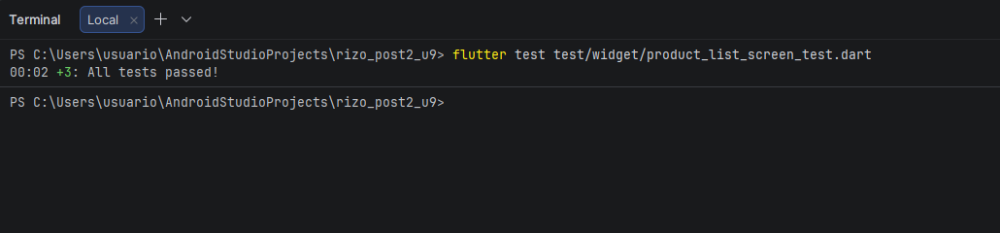
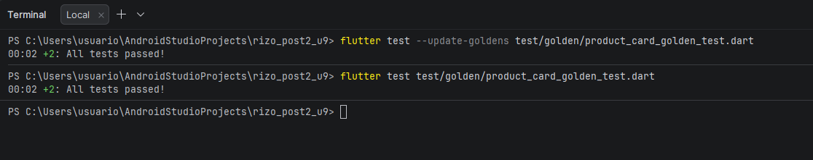
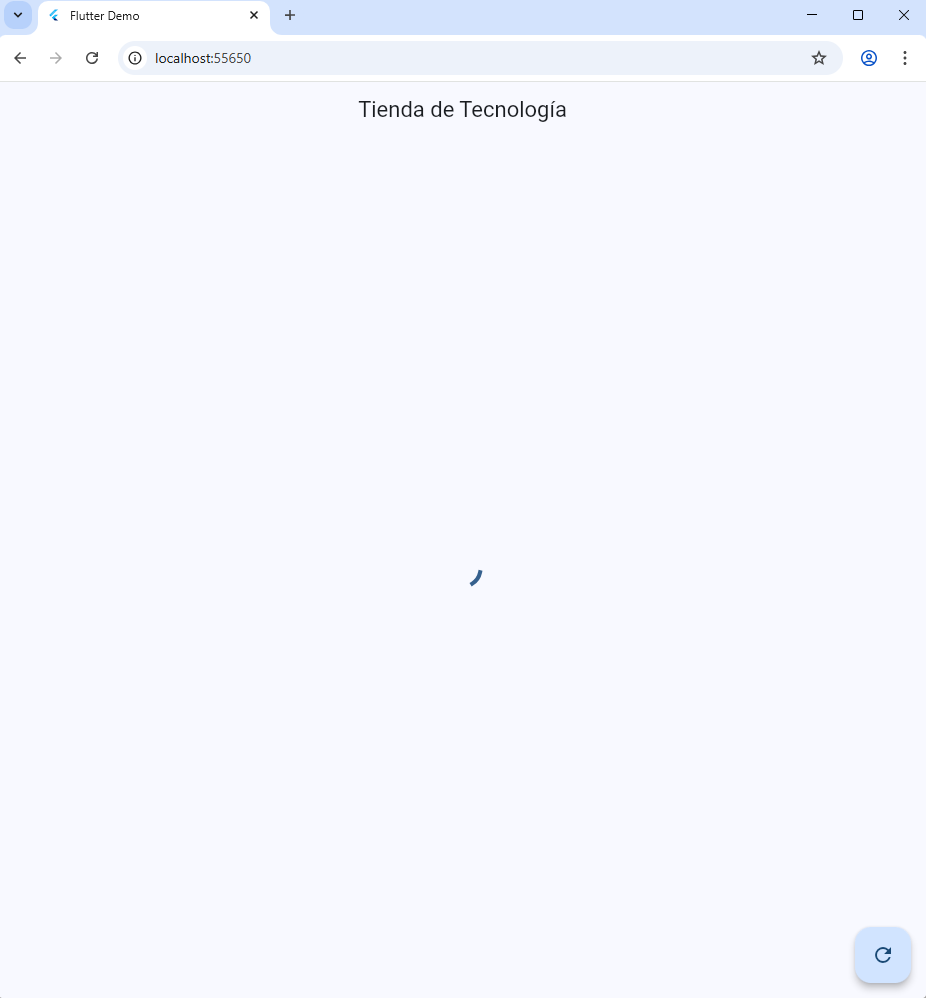
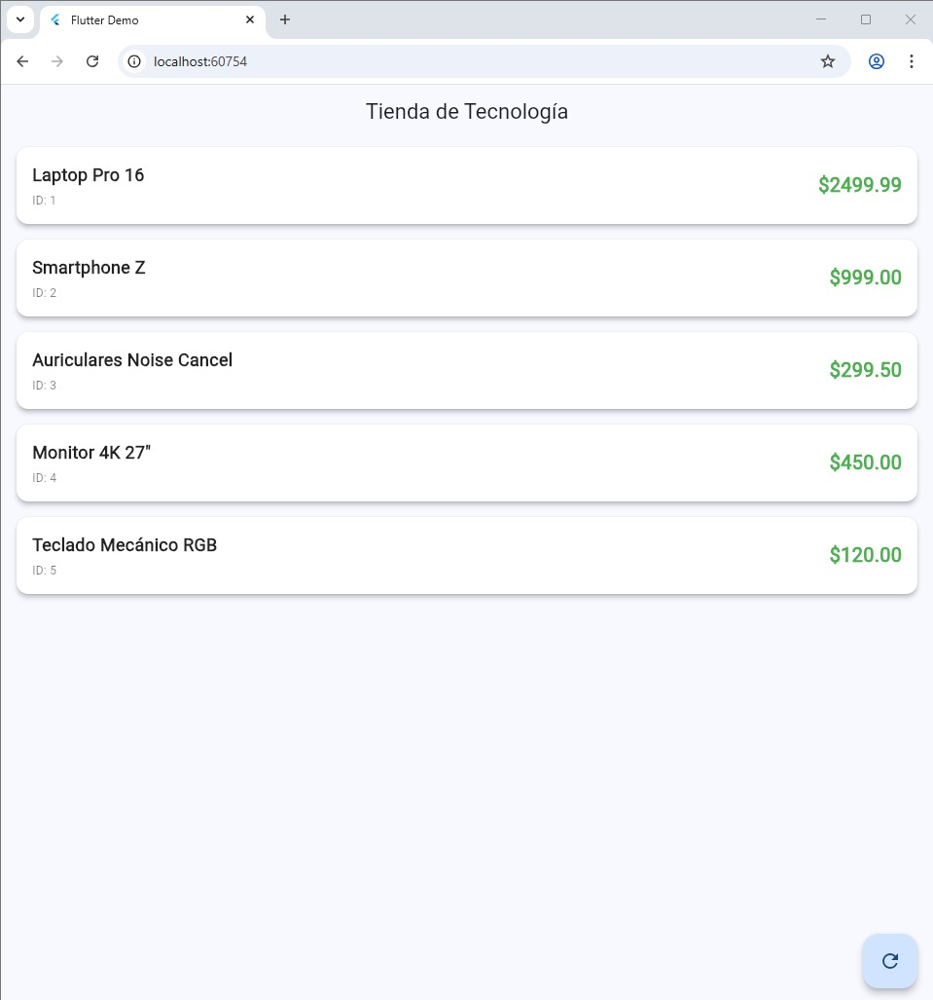
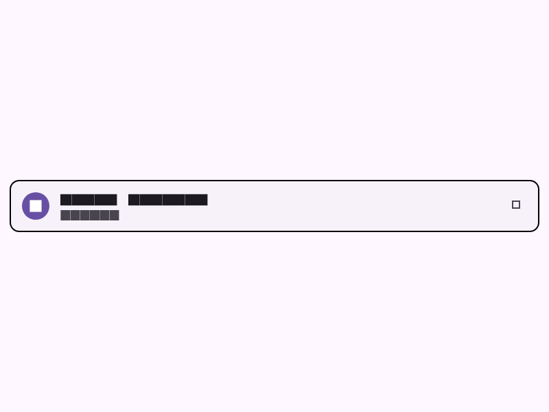

# Actividad Unidad 9 - Post-Contenido 2

## Autor
**Miguel Angel Rizo Arias**

## Descripción
Este proyecto es una aplicación de catálogo de productos desarrollada en Flutter como parte de la actividad de la Unidad 9. La aplicación se enfoca en la implementación de pruebas avanzadas (Widget Tests y Golden Tests) y el manejo de estados utilizando el patrón BLoC.

## Objetivo
El objetivo principal es demostrar el uso de buenas prácticas de desarrollo, Clean Code y Testing en Flutter. Se implementó una arquitectura desacoplada donde la lógica de negocio (BLoC) está separada de la interfaz de usuario y del origen de los datos (Repository).

## Tecnologías usadas
- **Flutter & Dart**: Framework y lenguaje principal.
- **flutter_bloc**: Para el manejo de estados.
- **equatable**: Para simplificar la comparación de objetos y estados.
- **mocktail**: Para la creación de mocks en las pruebas.
- **bloc_test**: Para facilitar el testing de los BLoCs.

## Arquitectura
Se utilizó el patrón **BLoC (Business Logic Component)**. La estructura del proyecto es la siguiente:
- **Model**: Define la estructura del producto (id, nombre, precio).
- **Repository**: Capa encargada de obtener los datos (simulada con un FakeRepository).
- **BLoC**: Gestiona los estados de la pantalla (Initial, Loading, Success, Error).
- **Widgets**: Componentes visuales reutilizables como el ProductCard.
- **Screens**: Pantallas principales de la aplicación.

## Widget tests
Se crearon pruebas para verificar que la interfaz responda correctamente a los diferentes estados del BLoC:
1. **Estado de Carga**: Se verifica que aparezca el indicador de progreso.
2. **Estado de Éxito**: Se comprueba que la lista muestre los nombres y precios de los productos.
3. **Estado de Error**: Se valida que aparezca el mensaje de error y el botón de reintentar.
4. **Interacción**: Se usa `verify` de mocktail para asegurar que el botón de reintentar dispare el evento de carga nuevamente.

## Golden tests
Implementamos Golden Tests para asegurar que el componente `ProductCard` se renderice exactamente igual en:
- Tema Claro (Light Mode)
- Tema Oscuro (Dark Mode)

Esto ayuda a detectar cambios visuales no deseados en futuras versiones.

## Cómo ejecutar
1. Clonar el repositorio.
2. Ejecutar `flutter pub get` para instalar dependencias.
3. Ejecutar la aplicación con `flutter run`.

## Cómo regenerar golden files
Si realizas cambios visuales y necesitas actualizar las capturas de referencia:
```bash
flutter test --update-goldens test/golden/product_card_golden_test.dart
```

## Estructura del proyecto
```text
lib/
 ├── bloc/          # Lógica de estados
 ├── model/         # Clases de datos
 ├── repository/    # Acceso a datos
 ├── widgets/       # Componentes visuales
 └── screen/        # Pantallas
test/
 ├── widget/        # Pruebas de widgets y lógica
 └── golden/        # Pruebas visuales (Golden)
```

## Capturas
TESTS






LOADING



SUCCESS



GOLDENS




## Conclusión
Esta actividad me permitió profundizar en la importancia del testing automatizado. El uso de Golden Tests es especialmente útil para mantener la consistencia visual, mientras que los Widget Tests aseguran que la lógica del usuario final funcione bajo cualquier circunstancia.
